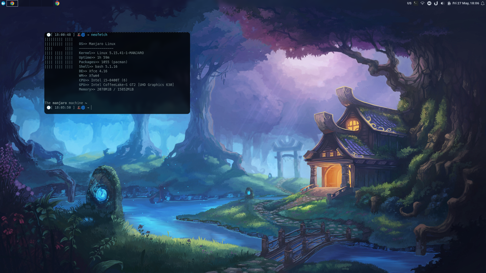

# xfce4-lambleeg-rice

This is my first try to rice the XFCE4, and I am stored everything you need by folders, so you just need to copy-paste it

However, I just made a tarball, and you can pick not everything but a couple of files instead. Also, it has my wallpaper for the LightDM that won't work for you since it's not a part of my configs, so you'll need to change the `sudo nano /etc/lightdm/slick-greeter.conf` and put the wallpaper you want. Remember, that there are hidden files like `.config`, and I have no idea how it's gonna work with your installation because I am not using the default picom and so on

## Packages I have installed

Here they are with one command on the Arch and Arch-based distros

```
yay -S xfce4-docklike-plugin xfce4-xkb-plugin xfce4-panel-profiles picom-ibhagwan-git
```

## Caution

All you do or make is up to you, it's your responsibility. The great power comes the great responsibility!
